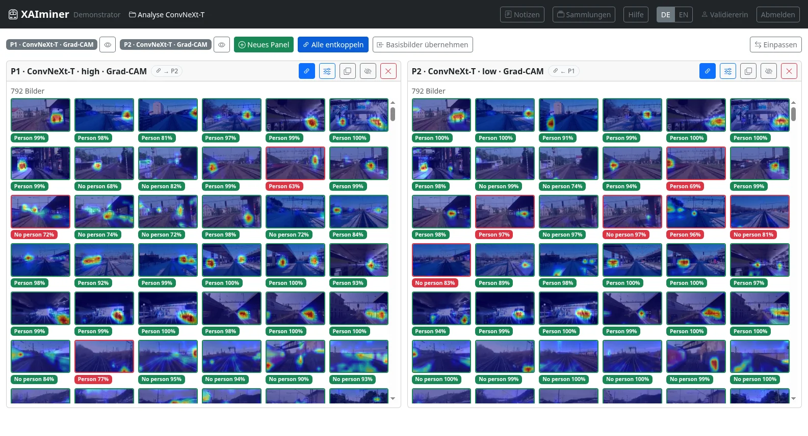

# XAIminer

**A test bench for AI models and their explanations.**

[](https://github.com/tud-xai/XAIminer/actions/workflows/ci.yml)
[](LICENSE)


XAIminer (*XAI* + *examiner*) is an interactive web application for inspecting image
classifiers together with their XAI explanations. Think of an engine test bench: the model is
the engine, the images are the fuel, the XAI methods are the sensors. XAIminer does not build
models; it shows how they behave under controlled conditions, so you can see **what a model pays
attention to** and **whether the explanation holds up**, and record your findings.

It was developed for person detection in the railway domain, but the data model is generic: any
image classification task whose predictions and XAI renderings you can export can be loaded.



## Features

- **Panel workspace:** any number of panels side by side, each with its own model, training
  stage, XAI method and filter. Compare architectures, checkpoints or XAI methods on the same
  images.
- **XAI methods:** Grad-CAM, LRP, and the concept-based methods CRP and CRAFT, including
  concept prototypes.
- **Filters:** scene attributes (environment, objects, time of day, weather), classification
  result (correct/incorrect), confidence range and distance. Live counts for every option.
- **Linked panels:** step through images and scroll galleries in sync across panels.
- **Model overview:** a confusion matrix and accuracy per model and stage. Click a cell to get
  the images behind it. The matrix is deliberately colour-free, so it stays readable with
  red-green colour blindness.
- **Collections:** hand-picked image sets that can be shared between panels.
- **Notes with reference points:** every finding records *which* images were shown in *which*
  configuration, and a single click restores that view.
- **Requirements and audit report:** rate report entries against a requirements catalogue
  (met / not met) and export the report as a PDF.
- **Bilingual UI** (German / English).
- **Ready for a public instance:** a demo mode with throwaway guest sandboxes, operator-created
  accounts, rate-limited login, CSRF protection, and no third-party requests.
- **Build-free:** Flask, Jinja and HTMX. No npm, no bundler, no SPA. All front-end libraries
  are vendored.

## Quick start

You need Python ≥ 3.11. Node.js is optional; it is only used to run the JS tests.

```bash
git clone https://github.com/tud-xai/XAIminer.git
cd XAIminer/xai_viewer
python -m venv .venv && source .venv/bin/activate
pip install -r requirements.txt

# A small synthetic dataset to play with (written to ../../datasets/mock)
python tools/make_mock_dataset.py
python tools/build_metadata.py mock

XAI_DEFAULT_DATASET=mock flask --app app run      # → http://127.0.0.1:5000
```

Sign in with any name (no password is needed for guests), pick the role *Validierer* and open
a project on the `mock` dataset.

## Using your own data

Datasets live **outside** the repository, one directory per dataset, laid out like this:
`originals/`, `xai/<model>/<stage>/<method>/`, `inference/` (prediction CSVs) and a generated
`metadata.json`. The app reads only `metadata.json`, which `tools/build_metadata.py` derives
from the raw files.

- [`xai_viewer/docs/setup.md`](xai_viewer/docs/setup.md): step-by-step guide from a fresh clone
  to your own dataset, including a minimal example.
- [`DATA.md`](DATA.md): the complete reference for directory layout, naming conventions, raw
  file formats and the `metadata.json` schema.

## Configuration

Local settings go in `xai_viewer/config.toml` (template: `config.toml.example`). Every setting
can also be set through an environment variable, which takes precedence:

| Variable | Purpose |
|---|---|
| `XAI_SECRET_KEY` | Signs the session cookie. **Required** for any shared instance. |
| `XAI_DATASETS_ROOT` / `XAI_DEFAULT_DATASET` | Where the datasets are, and which one is preselected. |
| `XAI_DEMO_MODE` | Public demo mode: throwaway guest sandboxes, size and amount limits, no search-engine indexing. |
| `XAI_ACCOUNTS_FILE` | Accounts of known users. Manage them with `tools/manage_accounts.py`. |
| `XAI_AUTH_USER` / `XAI_AUTH_PASSWORD_HASH` | Optional HTTP Basic Auth in front of the whole app (internal instances). |
| `XAI_COOKIE_SECURE` | Set this when the app is served over HTTPS. |
| `XAI_ALLOWED_ORIGINS` | Only needed if a proxy rewrites the Host header. |
| `XAI_LEGAL_FILE` | Imprint and privacy details of your instance (see below). |
| `XAI_TRACKING` / `XAI_TRACKING_DIR` | Opt-in click tracking for supervised usability sessions. |

### Imprint and privacy policy

Whoever runs a publicly reachable instance is responsible for its imprint and privacy policy.
Copy [`xai_viewer/legal.example.toml`](xai_viewer/legal.example.toml) to `xai_viewer/legal.toml`
and fill it in. The generic part of the privacy policy describes what the application itself
does (session cookie, stored content, guest retention, no third-party content) and is built in.
Until you provide the file, `/imprint` and `/privacy` state that nothing is configured.

## Deployment

In production the app runs under any WSGI server. `deployment/wsgi.py` is the entry point: it
reads a deployment `config.toml` (template: [`config-example.toml`](config-example.toml)) and
passes its values to the app:

```bash
pip install gunicorn
gunicorn --chdir deployment wsgi:app
```

The repository also ships a complete deployment script for an
[Uberspace](https://uberspace.de) account (gunicorn under supervisord, with backups of the user
data before every deploy): [`deployment/README.md`](deployment/README.md).

Two things to keep in mind:

- **There is no database.** User data (notes, collections, accounts, …) lives in JSON/TOML files
  inside `xai_viewer/`. Back those files up, and never overwrite them with a local copy.
- **The datasets are not part of the deployment.** They can be large. Keep them next to the
  deployed tree, and pre-generate thumbnails with `tools/make_thumbnails.py`.

## Documentation

| Document | Contents | Language |
|---|---|---|
| [`xai_viewer/docs/usage.md`](xai_viewer/docs/usage.md) | User guide, also shown in the app under *Help* | German |
| [`xai_viewer/docs/setup.md`](xai_viewer/docs/setup.md) | Installation and setup, from a fresh clone to your own data | German |
| [`BETRIEB.md`](BETRIEB.md) | Operator reference: scripts, deployment, accounts, demo mode, tracking, auxiliary tools, tests | German |
| [`DATA.md`](DATA.md) | Dataset layout, file formats, `metadata.json` schema | German |
| [`deployment/README.md`](deployment/README.md) | Uberspace deployment | German |

The UI is bilingual (German / English). The detailed documentation is currently written in
German.

## Running the tests

```bash
cd xai_viewer
python tools/make_mock_dataset.py && python tools/build_metadata.py mock
pip install pytest
python -m pytest tests/
```

The JS "island" tests run the inline scripts that are shipped with the templates, using Node.js
against a DOM stub. If `node` is not installed, they are skipped.

## Project layout

```
xai_viewer/            the Flask application (flat script layout, run from this directory)
├── app.py             routes and application logic
├── templates/         Jinja templates (HTMX partials under partials/)
├── static/            CSS, images, vendored Bootstrap / Bootstrap Icons / HTMX
├── i18n/              UI strings, de.toml + en.toml
├── tools/             data pipeline and maintenance scripts
├── docs/              user guides (rendered in the app as help pages)
└── tests/             backend tests + JS island tests
deployment/            WSGI entry point and Uberspace deployment script
```

## License

Copyright © 2026 Romy Müller, Sascha Weber, Carsten Knoll

XAIminer is free software: you can redistribute it and/or modify it under the terms of the
[GNU Affero General Public License v3.0](LICENSE). If you run a modified version as a network
service, the AGPL requires you to offer its source code to the service's users.

The AGPL covers the source code. The screenshots and the overview figure contain images from the
dataset *RailPer*, which is compiled from RailSem19, RAWPED and other sources. Those images are
subject to the licences of their source datasets.

## Funding

Diese Software wurde vom Deutschen Zentrum für Schienenverkehrsforschung (DZSF) im Rahmen des
Projekts XRAISE gefördert.

*This software was funded by the German Centre for Rail Traffic Research (DZSF) as part of the
project XRAISE.*
