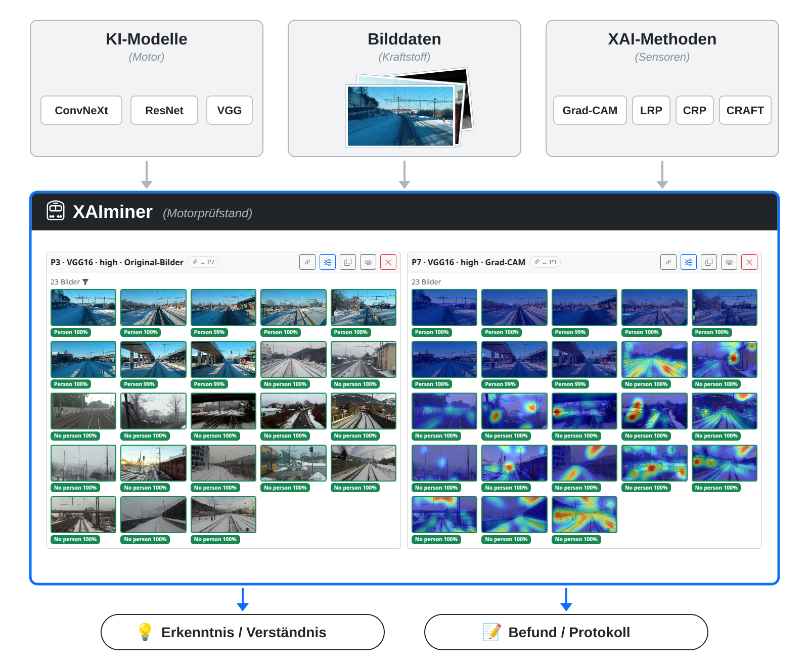
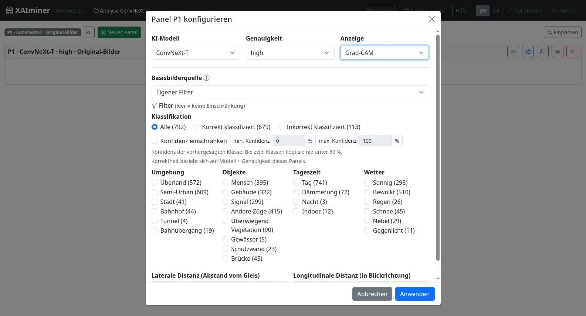
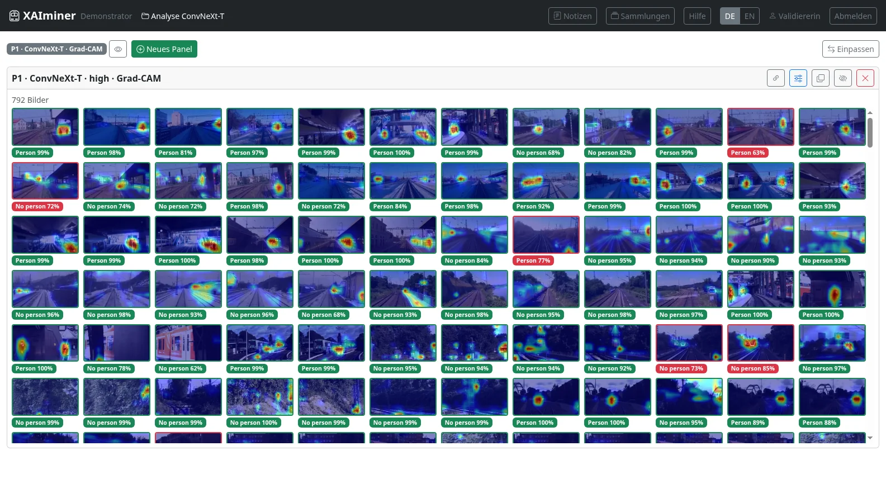
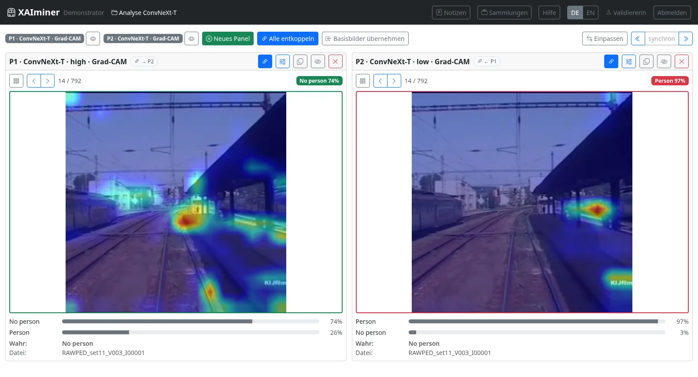
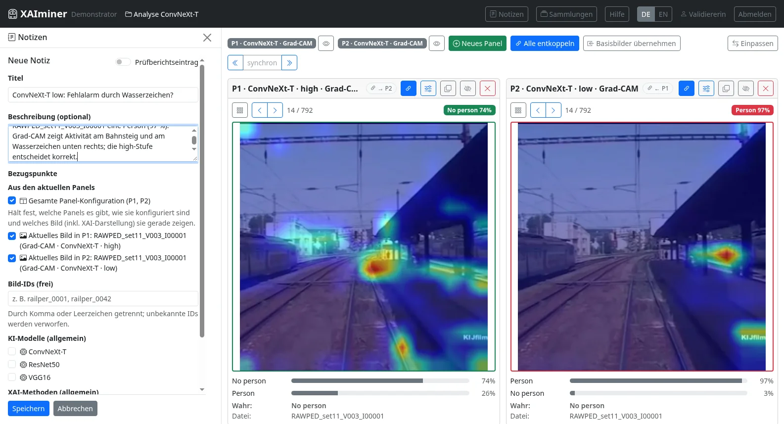
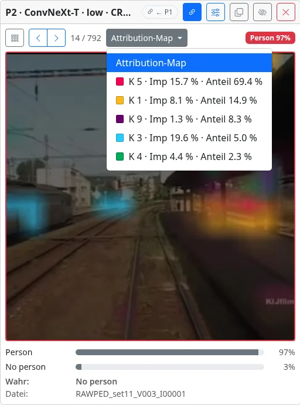
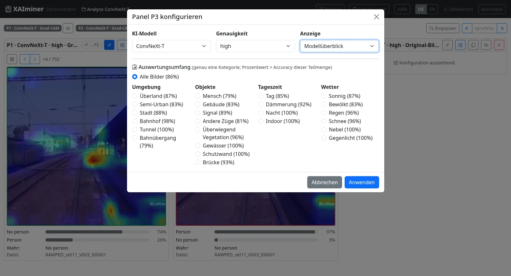
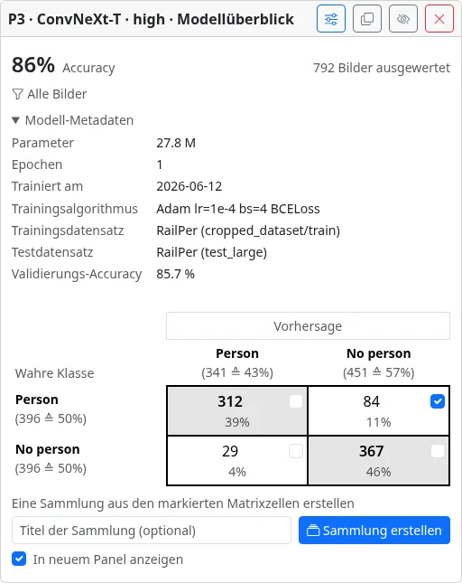

# XAIminer – Hilfe und Bedienung

## Wozu XAIminer

XAIminer ist ein **Prüfstand** für KI-Modelle — vergleichbar mit einem Motorprüfstand: Das
Modell ist der Motor, die Bilddaten sind der Kraftstoff, die XAI-Methoden die Sensoren. Der
Prüfstand baut keine Motoren; er macht sichtbar, wie sie unter kontrollierten Bedingungen
arbeiten.

Vorhandene KI-Modelle (hier: Personenerkennung im Bahnkontext) und etablierte XAI-Methoden
werden an ausgewählten Bildern kombiniert und nebeneinander betrachtet. Für die Bildauswahl
stehen Filter nach Szene, Klassifikationsergebnis und Konfidenz bereit. So lässt sich
nachvollziehen und festhalten, **worauf ein KI-Modell achtet** und **ob die Erklärung dazu
passt**.

### Anwendungsfall Validierung

Validierer:innen prüfen ein fertiges Modell, bevor es eingesetzt wird — ohne selbst zu
programmieren:

- **Nachvollziehen**, wie das Modell zu seinen Entscheidungen kommt: Liegt die Aufmerksamkeit
  auf der Person oder auf Hintergrund, Bildrand, Wasserzeichen?
- **Gezielt Schwachstellen suchen**: Fehlklassifikationen, unsichere Entscheidungen,
  schwierige Bedingungen (Nacht, Gegenlicht, Tunnel …), Accuracy je Teilmenge.
- **Befunde belegen**: Notizen mit Bezugspunkten halten fest, *welche* Bilder in *welcher*
  Darstellung gemeint sind — wiederherstellbar mit einem Klick.
- **Gegen Anforderungen prüfen und protokollieren**: Prüfberichtseinträge bewerten
  Anforderungen als erfüllt / nicht erfüllt; daraus entsteht der Prüfbericht.

### Anwendungsfall Entwicklung

Entwickler:innen nutzen denselben Prüfstand für ihre eigenen Modelle:

- **Abkürzungslernen („Clever Hans") aufdecken**: Hat das Modell eine Scheinkorrelation im
  Trainingsdatensatz gelernt statt des eigentlichen Merkmals?
- **Trainingsstände und Architekturen vergleichen**: Wie verschiebt sich die Aufmerksamkeit
  zwischen frühem und spätem Checkpoint, zwischen zwei Architekturen?
- **Datenlücken finden**: Unter welchen Bedingungen ist die Accuracy auffällig niedrig — und
  fehlen dafür Trainingsbeispiele?
- **XAI-Methoden gegeneinander stellen**: Zeigen Grad-CAM, LRP und konzeptbasierte Verfahren
  dasselbe?

Eigene Modelle kommen über ihre Vorhersagen und XAI-Renderings in einen Datensatz; wie das
geht, beschreibt [`setup.md`](setup.md#4-datensatz-vorbereiten). In der Anwendung selbst ist
dafür derzeit die Rolle *Validierer* zu wählen — eine eigene Entwickler-Rolle ist noch nicht
verfügbar.

<small>Beispielbilder aus dem Datensatz RailPer, zusammengestellt u. a. aus RailSem19 und
RAWPED; es gelten die Lizenzen der jeweiligen Quelldatensätze.</small>

---

## Über diese Anleitung

Diese Anleitung hat zwei Teile:

- **[Teil I – Erste Schritte](#teil-i--erste-schritte):** in etwa 15 Minuten von der Anmeldung
  bis zum ersten festgehaltenen Befund.
- **[Teil II – Fortgeschrittene Nutzung](#teil-ii--fortgeschrittene-nutzung):**
  Nachschlageteil zu allen Funktionen, dazu typische Arbeitsabläufe und eine
  Übersicht der Tastenkürzel.

Installation und Einrichtung der Daten: [`setup.md`](setup.md).

---

## Inhalt

**Teil I – Erste Schritte**

1. [Grundbegriffe](#1-grundbegriffe)
2. [Anmelden, Rolle, Projekt](#2-anmelden-rolle-projekt)
3. [Die Oberfläche im Überblick](#3-die-oberfläche-im-überblick)
4. [Das erste Panel konfigurieren](#4-das-erste-panel-konfigurieren)
5. [Galerie und Einzelbild](#5-galerie-und-einzelbild)
6. [Vergleichen mit einem zweiten Panel](#6-vergleichen-mit-einem-zweiten-panel)
7. [Den ersten Befund festhalten](#7-den-ersten-befund-festhalten)

**Teil II – Fortgeschrittene Nutzung**

8. [Filter im Detail](#8-filter-im-detail)
9. [Basisbilderquelle: Bildmengen zwischen Panels teilen](#9-basisbilderquelle-bildmengen-zwischen-panels-teilen)
10. [Panels verwalten und anordnen](#10-panels-verwalten-und-anordnen)
11. [Koppeln und synchron durchschalten](#11-koppeln-und-synchron-durchschalten)
12. [Konzeptbasierte Methoden: CRP und CRAFT](#12-konzeptbasierte-methoden-crp-und-craft)
13. [Modellüberblick und Konfusionsmatrix](#13-modellüberblick-und-konfusionsmatrix)
14. [Sammlungen](#14-sammlungen)
15. [Notizen und Bezugspunkte](#15-notizen-und-bezugspunkte)
16. [Anforderungen und Prüfbericht](#16-anforderungen-und-prüfbericht)
17. [Typische Arbeitsabläufe](#17-typische-arbeitsabläufe)
18. [Tastenkürzel](#18-tastenkürzel)
19. [Besonderheiten der öffentlichen Demo](#19-besonderheiten-der-öffentlichen-demo)

---

# Teil I – Erste Schritte

## 1. Grundbegriffe

| Begriff | Bedeutung |
|---|---|
| **Datensatz** | eine Bildmenge mit wahren Klassen, Modellvorhersagen und XAI-Renderings (z. B. `RailPer`). Ein Projekt arbeitet mit genau einem Datensatz. |
| **KI-Modell** | ein Klassifikator „Person / keine Person", z. B. `VGG16`, `ResNet50`, `ConvNeXt-T`. |
| **Genauigkeit** (Stufe) | Trainingsstand desselben Modells, typischerweise `low` / `mid` / `high`. Bei synthetischen Datensätzen kann die Stufe auch ein Trainingsregime bezeichnen (z. B. `trap` / `clean`). |
| **XAI-Methode** | Verfahren, das sichtbar macht, worauf das Modell achtet: `Grad-CAM`, `LRP` (Heatmaps), `CRP`, `CRAFT` (Konzepte). |
| **Panel** | eine Spalte im Arbeitsbereich mit eigener Konfiguration (Modell, Genauigkeit, Anzeige, Filter). Mehrere Panels nebeneinander sind der Normalfall — so wird verglichen. |
| **Basisbildmenge** | die Bilder, die ein Panel zeigt: das Ergebnis seiner Filter — oder übernommen von einem anderen Panel bzw. aus einer Sammlung. |
| **Sammlung** | eine gespeicherte, feste Bildmenge (Schnappschuss). |
| **Notiz** | ein festgehaltener Befund mit **Bezugspunkten** (Bilder, Panel-Konfiguration, Modelle, Methoden, Sammlungen). |
| **Prüfberichtseintrag** | eine Notiz, die zusätzlich Anforderungen als erfüllt / nicht erfüllt bewertet und in den **Prüfbericht** eingeht. |

## 2. Anmelden, Rolle, Projekt

**Anmelden.** Die Anmeldeseite bietet zwei Wege:

- **Als Gast anmelden** — nur einen Anzeigenamen eingeben (muss kein Klarname sein). Der
  Name erscheint in der Kopfleiste und als Verfasser an Notizen.
- **Als registrierter Nutzer anmelden** — Benutzername und Passwort eines vorab angelegten
  Kontos. Konten gibt es nur auf Anfrage („Login anfragen").

Auf der öffentlichen Demo werden Gast-Inhalte nach einer Weile ohne Aktivität gelöscht (die
Anmeldeseite nennt die Frist). Wer dauerhaft arbeiten will, braucht ein Konto.

**Tätigkeitsfeld wählen.** Aktiv ist **Validierer**; die übrigen Rollen sind in dieser
Version noch nicht verfügbar.

**Projekt anlegen.** Unter „Neues Projekt anlegen" einen Namen vergeben (vorbelegt:
„Analyse JJJJ-MM-TT"), den **Datensatz** wählen und **Starten**. Notizen, Sammlungen und
Anforderungskatalog gehören zum Datensatz — wer später wieder denselben Datensatz öffnet,
findet sie vor. („Vorhandenes Projekt laden" ist in dieser Version noch nicht verfügbar.)

## 3. Die Oberfläche im Überblick

*Zwei gekoppelte Panels: ConvNeXt-T mit Grad-CAM, links Stufe `high`, rechts `low` (P2 übernimmt die Bildmenge von P1).*

- **Kopfleiste:** *Notizen* öffnet das Notiz-Dock am linken Rand, *Sammlungen* die
  Sammlungsverwaltung, **DE | EN** wechselt die Sprache, *Hilfe* öffnet diese
  Anleitung in einem neuen Tab, ganz rechts *Abmelden*.
- **Panel-Leiste:** ein Eintrag je Panel (mit Auge zum Ein-/Ausblenden), *Neues Panel*,
  ab zwei Panels *Alle koppeln* und *Basisbilder übernehmen*, rechts der Umschalter
  *Einpassen / Scrollen* und — wenn gekoppelte Panels in der Einzelbildansicht sind — die
  Schaltfläche *synchron*.
- **Panel-Kopf:** Kennung und aktuelle Konfiguration (z. B. `P1 · ConvNeXt-T · high · Grad-CAM`),
  ein Abzeichen zur Bildquelle (`→ P2`: P2 nutzt die Bildmenge dieses Panels), dahinter die Knöpfe **Koppeln** (Kette), **Konfigurieren** (Schieberegler), **Duplizieren**,
  **Ausblenden** und **Löschen**.

Die Anwendung ist für Desktop-Bildschirme gebaut; unter 768 px Fensterbreite erscheint ein
Hinweis statt des Arbeitsbereichs.

## 4. Das erste Panel konfigurieren

Nach dem Projektstart öffnet sich automatisch der Dialog **„Panel P1 konfigurieren"**:

1. **KI-Modell** wählen, z. B. `ConvNeXt-T`.
2. **Genauigkeit** wählen, z. B. `high`.
3. **Anzeige** wählen:
   - *Original-Bilder* — die Bilder ohne Erklärung,
   - eine **XAI-Methode** — nur die für Modell + Genauigkeit verfügbaren sind wählbar,
   - *Modellüberblick* — statt Bildern Konfusionsmatrix und Modelldaten
     ([Abschnitt 13](#13-modellüberblick-und-konfusionsmatrix)).
4. Optional **Filter** setzen, z. B. *Klassifikation: Inkorrekt klassifiziert*. Leere Filter
   bedeuten „keine Einschränkung". Die Zahl in Klammern hinter jeder Option zeigt, wie viele
   Bilder damit übrig blieben.
5. **Anwenden**.

Die Konfiguration lässt sich jederzeit über den Schieberegler-Knopf im Panel-Kopf ändern.
Wer den Dialog ohne *Anwenden* schließt, sieht im Panel „Konfiguration ausstehend".

## 5. Galerie und Einzelbild

**Galerie.** Das Panel zeigt die gefilterten Bilder als Vorschaubilder, darüber die Anzahl
(ein Trichter-Symbol zeigt aktive Filter; Mauszeiger darauf nennt sie). Unter jedem Bild
steht ein Abzeichen mit der **Vorhersage und ihrer Konfidenz**:

- **grün** = korrekt klassifiziert,
- **rot** = falsch klassifiziert,
- **gelb „kein XAI"** = für dieses Bild gibt es in der gewählten Kombination kein
  Erklärungsbild; gezeigt wird das Original.

Der Mauszeiger über einem Bild zeigt Dateiname, wahre Klasse, Vorhersage und alle
Konfidenzen.

**Einzelbild.** Ein **Klick** auf ein Vorschaubild öffnet es groß im Panel. Dort stehen:

- **Pfeile** zum Vor- und Zurückblättern innerhalb der Bildmenge des Panels, daneben die
  Position (`17 / 812`),
- das Abzeichen *Vorhersage + Konfidenz* (grün/rot wie oben),
- unter dem Bild die **Konfidenzen aller Klassen** als Balken, die **wahre Klasse** und der
  **Dateiname**,
- der Galerie-Knopf (Raster-Symbol) führt zurück.

Das jeweils nächste Bild wird im Hintergrund vorgeladen; Weiterblättern ist deshalb schnell.

## 6. Vergleichen mit einem zweiten Panel

Der eigentliche Nutzen entsteht im Vergleich. Der schnellste Weg:

1. Im Panel P1 auf **Duplizieren** klicken — es entsteht P2 mit identischer Konfiguration.
2. In P2 **Konfigurieren** und genau *eine* Sache ändern, z. B. die Anzeige von `Grad-CAM`
   auf `CRAFT` (Methodenvergleich) oder die Genauigkeit von `high` auf `low`
   (Trainingsstand-Vergleich).
3. In der Panel-Leiste **Alle koppeln**. Gekoppelte Panels scrollen in der Galerie gemeinsam.
4. In einem der Panels ein Bild anklicken und mit den Pfeiltasten **← / →** blättern —
   **alle gekoppelten Panels in der Einzelbildansicht** schalten synchron weiter.

So stehen dieselben Bilder mit zwei verschiedenen Erklärungen bzw. zwei Modellständen direkt
nebeneinander.

*Dasselbe Bild in zwei Trainingsständen von ConvNeXt-T. Die Stufe `high` (links) entscheidet korrekt „No person“; die Stufe `low` (rechts) meldet mit 97 % eine Person — ihre Heatmap liegt auf dem Bahnsteig und auf dem Wasserzeichen unten rechts. Genau solche Befunde hält man als Notiz fest.*

> **Tipp:** Damit wirklich dieselben Bilder in derselben Reihenfolge nebeneinanderstehen,
> auch wenn P2 andere Filter hätte, kann P2 seine Bildmenge von P1 übernehmen
> ([Abschnitt 9](#9-basisbilderquelle-bildmengen-zwischen-panels-teilen)).

## 7. Den ersten Befund festhalten

Fällt etwas auf — wie im Beispiel oben die Heatmap auf dem Wasserzeichen:

1. Taste **n** (oder *Notizen* in der Kopfleiste) öffnet das Notiz-Dock.
2. **Neue Notiz**.
3. **Titel** (kurz und prägnant) und optional eine **Beschreibung** eingeben.
4. Unter **Bezugspunkte** ist die aktuelle Panel-Konfiguration bereits vorausgewählt. Zusätzlich
   lässt sich z. B. das **aktuelle Bild** eines Panels ankreuzen.
5. **Speichern**.

Die Notiz erscheint in der Liste. Ein Klick auf einen ihrer Bezugspunkte stellt den damaligen
Zustand wieder her — ein Bild wird geöffnet, eine gespeicherte Panel-Konfiguration geladen.
Damit ist ein Befund auch Wochen später noch nachvollziehbar.

**Esc** schließt das Dock wieder.

Damit sind die Grundfunktionen abgedeckt. Teil II beschreibt alles Weitere.

---

# Teil II – Fortgeschrittene Nutzung

## 8. Filter im Detail

Filter werden im Konfigurationsdialog jedes Panels gesetzt und gelten nur für dieses Panel.

**Szenenattribute** — *Umgebung*, *Objekte*, *Tageszeit*, *Wetter* (die genauen Kategorien
kann ein Datensatz selbst mitbringen):

- **Innerhalb einer Kategorie ODER**, **zwischen Kategorien UND.** *Umgebung: Bahnhof,
  Stadt* + *Wetter: Regen* bedeutet „(Bahnhof oder Stadt) und Regen".
- Ein Bild kann in einer Kategorie mehrere Werte tragen (z. B. Semi-Urban **und**
  Bahnübergang).
- Die Zahl hinter jeder Option aktualisiert sich beim Ankreuzen. Sie berücksichtigt alle
  *anderen* gesetzten Filter, nicht die eigene Kategorie — sie beantwortet also „wie viele
  Bilder kämen hinzu, wenn ich diese Option auch wähle".

> **Hinweis zur Datenlage:** Sind für einen Datensatz keine Handlabels hinterlegt, sind diese
> Attribute **Platzhalterwerte**. Die Filter funktionieren dann technisch, sagen inhaltlich
> aber nichts. Ob echte Labels vorliegen, weiß die Person, die den Datensatz eingerichtet hat
> ([`setup.md`](setup.md#5-metadaten-erzeugen-metadatajson)).

**Distanzen** — *laterale Distanz* (Abstand der Person vom Gleis, 0–20 m) und
*longitudinale Distanz* (in Blickrichtung, 0–1000 m) als Bereich von–bis. Solange ein Regler
den vollen Bereich abdeckt, schränkt er nichts ein. Wird er eingeengt, fallen Bilder
**ohne** Distanzwert (z. B. Szenen ohne Person) heraus.

**Klassifikation** — *Alle*, *Korrekt klassifiziert*, *Inkorrekt klassifiziert*. Bezieht
sich auf **Modell und Genauigkeit dieses Panels**. Der schnellste Weg zu den Fehlerfällen.

**Konfidenz** — erst nach Ankreuzen von *Konfidenz einschränken* aktiv; dann min./max. in
Prozent. Gemeint ist die Konfidenz der **vorhergesagten** Klasse; bei zwei Klassen liegt sie
nie unter 50 %. Beispiele: *max. 65 %* für unsichere Entscheidungen, *min. 98 %* für sehr
sichere — interessant in Kombination mit *Inkorrekt klassifiziert* („sicher und falsch").

## 9. Basisbilderquelle: Bildmengen zwischen Panels teilen

Im Konfigurationsdialog legt **Basisbilderquelle** fest, woher ein Panel seine Bilder nimmt:

| Quelle | Wirkung |
|---|---|
| **Eigener Filter** (Standard) | die Bildmenge ergibt sich aus den Filtern dieses Panels |
| **Panel P*n*** | dieses Panel übernimmt die gefilterte Bildmenge **inklusive Reihenfolge** von P*n* und stellt sie mit seiner **eigenen** Modell-/Anzeige-Konfiguration dar; die eigenen Filter sind dann inaktiv |
| **Sammlung „…"** | die feste Bildmenge einer Sammlung ([Abschnitt 14](#14-sammlungen)) |

Ein Abzeichen im Panel-Kopf zeigt, woher die Bilder stammen bzw. welche anderen Panels die
Bildmenge dieses Panels mitbenutzen. Ein Panel, das selbst Quelle für andere ist, kann keine
fremde Quelle übernehmen.

**Basisbilder übernehmen** (Panel-Leiste, ab zwei Panels) stellt mit einem Klick alle
sichtbaren Bild-Panels so ein, dass sie **Bildmenge, Modell und Genauigkeit** vom ganz linken
Panel beziehen; die Anzeige (XAI-Methode) behält jedes Panel, sofern sie für das neue Modell
verfügbar ist. Praktisch für den Methodenvergleich auf identischen Bildern. Die eigenen Filter
der übrigen Panels bleiben gespeichert, man kann später zu *Eigener Filter* zurückwechseln.

Typische Anwendung: P1 filtert auf „inkorrekt klassifiziert" für `VGG16/high`; P2 und P3
übernehmen diese Bildmenge und zeigen sie mit LRP bzw. CRAFT — so vergleicht man die
Methoden genau auf den Fehlerfällen von P1.

## 10. Panels verwalten und anordnen

- **Neues Panel** (Panel-Leiste) legt ein leeres Panel an und öffnet dessen
  Konfigurationsdialog. **Duplizieren** (Panel-Kopf) kopiert ein bestehendes samt Filtern.
  Es gibt höchstens 12 Panels.
- **Ausblenden** (Auge) nimmt ein Panel aus der Ansicht, ohne es zu löschen. In der
  Panel-Leiste bleibt es gedimmt sichtbar und lässt sich dort wieder einblenden.
- **Löschen** (✕) entfernt ein Panel nach Rückfrage.
- **Einpassen / Scrollen** (rechts in der Panel-Leiste): *Einpassen* verteilt alle
  sichtbaren Panels auf die Bildschirmbreite, *Scrollen* gibt jedem Panel eine feste Breite
  und macht den Arbeitsbereich horizontal scrollbar — besser ab etwa vier Panels.

## 11. Koppeln und synchron durchschalten

Der **Ketten-Knopf** im Panel-Kopf koppelt ein Panel (blau = gekoppelt); *Alle koppeln* /
*Alle entkoppeln* in der Panel-Leiste schaltet alle auf einmal.

Gekoppelte Panels

- **scrollen in der Galerie gemeinsam**,
- **blättern in der Einzelbildansicht gemeinsam**: mit **← / →**, mit der Schaltfläche
  *synchron* in der Panel-Leiste oder mit den Pfeilen eines gekoppelten Panels.

Nicht gekoppelte Panels bleiben davon unberührt — man kann also z. B. zwei Panels
synchron vergleichen und ein drittes unabhängig als Referenz stehen lassen. Die Pfeiltasten
wirken nicht, solange der Cursor in einem Eingabefeld steht.

Für ein **Bild-für-Bild-Vergleich** mit identischer Bildfolge sollten die Panels dieselbe
Bildmenge haben (gleiche Filter oder gemeinsame Basisbilderquelle, [Abschnitt 9](#9-basisbilderquelle-bildmengen-zwischen-panels-teilen)).

## 12. Konzeptbasierte Methoden: CRP und CRAFT

Grad-CAM und LRP liefern je Bild **eine** Heatmap. CRP und CRAFT zerlegen die Entscheidung
dagegen in **Konzepte** — vom Modell gelernte, wiederkehrende Bildmuster. In der
Einzelbildansicht erscheinen dafür zusätzliche Auswahlfelder.

**CRP (Concept Relevance Propagation)**

- **Konzept (nach Relevanz):** die relevantesten Konzepte *dieses* Bildes, sortiert nach
  Einfluss, mit vorzeichenbehafteter Relevanz — **positiv** spricht *für* die Vorhersage,
  **negativ** *dagegen*.
- **Bildtyp:** *Heatmap* zeigt, **wo** im Bild das gewählte Konzept aktiv ist; *Beispiele*
  zeigt ein Raster typischer Ausschnitte aus anderen Bildern, also **was** das Konzept
  generell ist.
- In der Galerie steht je Bild die Heatmap des einflussreichsten Konzepts.

**CRAFT**

- Standardansicht ist die **Attribution-Map**: eine farbcodierte Karte, die alle Konzepte
  zugleich zeigt.
- Das Auswahlmenü listet die Konzepte mit **Farbfeld** (= Farbe der Region in der Karte),
  **Imp** (globale Wichtigkeit des Konzepts für die Klasse, bildunabhängig) und **Anteil**
  (Anteil an der Konzept-Aktivierung *dieses* Bildes). Ein gewähltes Konzept zeigt dessen
  Beispielraster.

*ConvNeXt-T (`low`) mit CRAFT, dasselbe Bild wie in Abschnitt 6: Konzept K 5 macht knapp 70 % der Aktivierung aus.*

Beide Methoden stehen nur für die Modell/Genauigkeit-Kombinationen zur Verfügung, für die
der Datensatz sie enthält; im Konfigurationsdialog sind sie sonst nicht wählbar.

## 13. Modellüberblick und Konfusionsmatrix

Wählt man im Konfigurationsdialog unter **Anzeige** den Eintrag *Modellüberblick*, zeigt
das Panel statt Bildern eine Auswertung für Modell + Genauigkeit:

- **Accuracy** — aus den Vorhersagen des aktuellen Auswertungsumfangs berechnet.
- **Konfusionsmatrix** — wahre Klasse × Vorhersage mit Bildanzahlen. Die Diagonale
  (korrekte Fälle) ist grau hinterlegt und fett gesetzt, **bewusst ohne Rot/Grün**
  (Rot-Grün-Sehschwäche).
- **Modell-Metadaten** (aufklappbar) — Parameterzahl, Epochen, Trainingsdatum, Trainingsalgorithmus,
  Trainings-/Testdatensatz und die **Validierungs-Accuracy** des Checkpoints (nicht zu
  verwechseln mit der oben berechneten Accuracy). Fehlende Angaben erscheinen als „N/A".

**Auswertungsumfang:** Im Konfigurationsdialog lässt sich die Auswertung auf **genau eine**
Kategorie einschränken (z. B. *Tageszeit: Nacht*). Hinter jeder Option steht schon im Dialog
die Accuracy dieser Teilmenge — so sieht man auf einen Blick, unter welchen Bedingungen ein
Modell schwächer ist.

**Aus der Matrix eine Sammlung machen:** Jede Matrixzelle hat ein Kästchen. Eine oder mehrere
Zellen ankreuzen (z. B. „wahr: Person, Vorhersage: keine Person" = übersehene Personen),
optional einen Titel eingeben, **Sammlung erstellen** — wahlweise gleich **in neuem Panel
anzeigen**. Das ist der direkte Weg von der Statistik zu den Einzelfällen.

*Modellüberblick für ConvNeXt-T (`high`) auf RailPer. Angekreuzt ist die Zelle der 84 übersehenen Personen — ein Klick auf „Sammlung erstellen“ öffnet sie als eigenes Panel.*

Mehrere Modellüberblick-Panels nebeneinander vergleichen Modelle oder Trainingsstände
quantitativ.

## 14. Sammlungen

Eine Sammlung ist ein **fester Schnappschuss** einer Bildmenge. Anders als ein Filter ändert
sie sich nicht, wenn sich Filter oder Daten ändern — sie bleibt „die Bilder, über die ich
gesprochen habe".

**Entstehen** aus Zellen der Konfusionsmatrix ([Abschnitt 13](#13-modellüberblick-und-konfusionsmatrix)).

**Verwenden:** im Konfigurationsdialog eines Panels als *Basisbilderquelle* wählen oder in der
Verwaltung **Öffnen** (neues Panel).

**Verwalten** über *Sammlungen* in der Kopfleiste:

| Aktion | Wirkung |
|---|---|
| Umbenennen | ändert nur den Titel |
| Kopie | legt eine unabhängige Kopie an |
| Bilder hinzufügen zu … | fügt die Bilder dieser Sammlung einer anderen hinzu; die Quelle bleibt unverändert |
| Bilder anzeigen / entfernen | einzelne Bilder ankreuzen und entfernen |
| Löschen | entfernt die Sammlung |

**Schutz durch Notizen (🔒):** Ist eine Sammlung Bezugspunkt einer Notiz, wird sie gegen
Veränderung geschützt — sonst würde die Notiz nachträglich über etwas anderes sprechen.
Verändernde Aktionen (Bilder hinzufügen/entfernen) legen dann automatisch eine **Kopie** an,
Löschen wird verweigert, Umbenennen bleibt erlaubt. Die Verwaltung zeigt, welche Notizen die
Sammlung referenzieren.

## 15. Notizen und Bezugspunkte

Notizen leben im **Notiz-Dock** (Taste **n**, schließen mit **Esc**). Sie gehören zu Person
und Datensatz.

**Bezugspunkte** machen eine Notiz nachvollziehbar. Eine Notiz kann beliebig viele davon
haben:

| Bezugspunkt | hält fest | Klick darauf … |
|---|---|---|
| **Gesamte Panel-Konfiguration** | welche Panels es gibt, wie sie konfiguriert sind und welches Bild (inkl. Darstellung) sie gerade zeigen | lädt diese Panel-Konfiguration (ersetzt die aktuellen Panels, nach Rückfrage) |
| **Aktuelles Bild in P*n*** | ein Bild samt Darstellung (Modell/Genauigkeit/XAI) | öffnet das Bild in einem wählbaren Panel oder einem neuen |
| **Bild-IDs (frei)** | beliebige Bilder per Dateiname, durch Komma oder Leerzeichen getrennt | wie oben |
| **KI-Modelle / XAI-Methoden (allgemein)** | eine Aussage über ein Modell oder eine Methode insgesamt | — |
| **Sammlungen** | eine Sammlung (schützt sie, siehe [Abschnitt 14](#14-sammlungen)) | öffnet die Sammlung in einem neuen Panel |

- Beim Anlegen ist die aktuelle Panel-Konfiguration **vorausgewählt**.
- Wer ohne jeden Bezugspunkt speichern will, wird gewarnt; Speichern bleibt möglich.
- Beim **Bearbeiten** lassen sich bestehende Bezugspunkte per Haken entfernen und eine
  gespeicherte Panel-Konfiguration **auf den aktuellen Arbeitsstand aktualisieren**.
- Ungespeicherte Änderungen werden vor dem Verwerfen abgefragt.

## 16. Anforderungen und Prüfbericht

**Prüfberichtseintrag.** Im Notizformular schaltet der Schalter *Prüfberichtseintrag* eine
Tabelle mit den **Anforderungen** des Katalogs frei. Je Anforderung wird angekreuzt:
*erfüllt*, *nicht erfüllt* oder nichts (= keine Angabe). Den Volltext einer Anforderung zeigt
der Mauszeiger bzw. das (i)-Symbol. Prüfberichtseinträge sind in der Notizliste als solche
gekennzeichnet.

**Anforderungskatalog bearbeiten.** Das Stift-Symbol neben dem (i) öffnet den Katalog als
Text (TOML-Format: je Anforderung ein Block mit festem `label`, z. B. `A5`, und Text auf
Deutsch und Englisch). Beim ersten Speichern entsteht eine **eigene Fassung** für diese
Person und diesen Datensatz; bis dahin gilt der mitgelieferte Standard.
*Auf Standard zurücksetzen* verwirft die eigene Fassung.

> **Vorsicht:** Eine umformulierte Anforderung ändert nachträglich die Bedeutung bereits
> abgegebener Bewertungen. Wird eine Anforderung gelöscht, verschwinden die zugehörigen
> Bewertungen aus allen eigenen Prüfberichtseinträgen (der Dialog fragt vorher nach).

**Prüfbericht erzeugen.** Die Schaltfläche *Prüfbericht* im Notiz-Dock öffnet in einem
neuen Tab einen Bericht aus **allen Prüfberichtseinträgen** des Datensatzes: Kopfdaten
(Projekt, Datensatz, Datum), eine **Übersicht** je Anforderung (erfüllt / nicht erfüllt /
keine Angabe) und die Einträge mit ihren Bezugspunkten. Von dort: *Drucken / als PDF
speichern* über den Browser oder *Als PDF herunterladen*.

## 17. Typische Arbeitsabläufe

**A. Fehlerfälle eines Modells untersuchen**

1. Panel P1: Modell/Genauigkeit wählen, Anzeige *Modellüberblick* — Accuracy und
   Konfusionsmatrix ansehen.
2. Zelle „wahr: Person / Vorhersage: keine Person" ankreuzen → *Sammlung erstellen*,
   *in neuem Panel anzeigen*.
3. Im neuen Panel eine XAI-Methode einstellen, durch die Fälle blättern: Worauf achtet das
   Modell, wenn es eine Person übersieht?
4. Muster als Notiz mit Bezugspunkt *Sammlungen* und einzelnen Beispielbildern festhalten.

**B. XAI-Methoden vergleichen**

1. P1 konfigurieren (z. B. `VGG16 / high / Grad-CAM`), zweimal duplizieren.
2. P2 auf `LRP`, P3 auf `CRAFT` umstellen; P2 und P3 als Basisbilderquelle *Panel P1*.
3. *Alle koppeln*, ein Bild öffnen, mit **← / →** durchblättern.
4. Stimmen die Methoden überein? Wo widersprechen sie sich?

**C. Trainingsstände vergleichen**

Wie B, aber in P2/P3 nur die **Genauigkeit** ändern (`low`, `mid`) und Anzeige gleich lassen.
Ergänzend je Stufe ein *Modellüberblick*-Panel für die Zahlen.

**D. Abkürzungslernen („Clever Hans") aufdecken**

Bei einem synthetischen Datensatz mit eingebauter Scheinkorrelation (z. B. Gebäude ↔ Person,
Stufen `trap` / `clean`):

1. P1: `trap`, P2: `clean`, gleiches Modell, gleiche XAI-Methode, P2 übernimmt die Bildmenge
   von P1.
2. Filter in P1 z. B. *Objekte: Gebäude*, ohne Person — genau hier sollte ein Modell, das die
   Abkürzung gelernt hat, fälschlich „Person" sagen.
3. Koppeln und vergleichen: Liegt die Heatmap des `trap`-Modells auf dem Gebäude statt auf
   einer Person?

**E. Unsichere Entscheidungen prüfen**

Filter *Konfidenz einschränken*, max. 65 %. Bei korrekten *und* falschen Fällen ansehen,
ob die Erklärung auf das Relevante zeigt — oder ob das Modell „rät".

## 18. Tastenkürzel

| Taste | Wirkung | wo |
|---|---|---|
| **← / →** | alle gekoppelten Panels in der Einzelbildansicht ein Bild zurück / vor | Arbeitsbereich |
| **n** | Notiz-Dock öffnen | überall im Arbeitsbereich |
| **Esc** | oberste Ebene schließen: Auswahldialog → Anforderungs-Legende → offenes Notizformular (abbrechen) → Notiz-Dock | Arbeitsbereich |

Einzeltasten wirken nicht, solange der Cursor in einem Eingabefeld steht — dort wird getippt.
**Esc** wirkt immer.

## 19. Besonderheiten der öffentlichen Demo

Auf einer öffentlich erreichbaren Instanz ist der **Demo-Modus** aktiv:

- Jeder Gast arbeitet in einer **privaten Sandbox**; andere sehen seine Notizen und
  Sammlungen nicht. Nach 48 Stunden ohne Aktivität wird die Sandbox gelöscht.
- Eine frische Sandbox enthält **Beispielnotizen** — eigene Kopien, die man ändern und löschen
  darf.
- Je Datensatz sind höchstens **100 Notizen** und **50 Sammlungen** möglich, der
  Anforderungskatalog ist auf 20 000 Zeichen begrenzt.

Mit einem **Konto** bleiben die eigenen Daten dauerhaft erhalten; die Mengengrenzen gelten auf
der Demo-Instanz aber auch dann.

